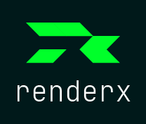

Source-available (non‑commercial).
Commercial licenses via EULA (See EULA-COMMERCIAL.md for commercial use).


# renderx

## Introduction

`renderx` is a lightweight dependency-free templating engine designed for use within Custom Elements (Web Components). It provides reactive templating features through directives, making it easy to create dynamic, state-driven components without a full framework.

### Size

- Minified: 13.0 KB (ESM), 13.0 KB (CJS)
- Gzipped: 4.7 KB

## Core Concepts

`renderx` is called within a Custom Element's context and operates on its shadow DOM. It provides several directives to handle common UI patterns:

- `x-if` for conditional rendering
- `x-for` for list rendering
- `x-class` for conditional classes
- `x-*` for dynamic attributes
- `render` for text content interpolation
- `@event` for event handling
- `render.plugin` for plugin execution

## Logging System

renderx includes a flexible logging system controlled by the `logs` attribute. You can enable logging for specific features:

```html
<!-- Enable all logs -->
<my-component logs="all"></my-component>

<!-- Enable specific feature logs -->
<my-component logs="for, if, attr, class, render, plugins"></my-component>
```

Available log categories:
- `plugins`: Plugin execution and results
- `for`: x-for loop processing
- `if`: x-if conditional rendering
- `attr`: x-attr attribute processing
- `class`: x-class processing
- `render`: Text content rendering

## Basic Usage

### With Custom Elements (Web Components)

#### With Shadow DOM

```js
class MyElement extends HTMLElement {
  constructor() {
    super();
    this.attachShadow({ mode: 'open' });
  }

  // Example component state
  users = [
    { name: 'Alice', active: true },
    { name: 'Bob', active: false }
  ];

  connectedCallback() {
    this.shadowRoot.innerHTML = `
      <div>
        <h2 render="title">User List</h2>
        <template x-for="user of users">
          <div x-class="(active, user.active)">
            <span render="user.name"></span>
          </div>
        </template>
      </div>
    `;
    renderx.call(this);
  }
}
```

#### Without Shadow DOM (plain Light DOM)

```js
import { renderx } from './src/renderx.js';

class MyElement extends HTMLElement {
  // Example component state
  title = 'User List';
  users = [
    { name: 'Alice', active: true },
    { name: 'Bob', active: false }
  ];

  connectedCallback() {
    // Render directly into light DOM (no shadow root)
    this.innerHTML = `
      <div>
        <h2 render="title"></h2>
        <template x-for="user of users">
          <div x-class="(active, user.active)">
            <span render="user.name"></span>
            <button @click="toggleUser(user)">Toggle</button>
          </div>
        </template>
      </div>
    `;
    renderx.call(this); // uses 'this' as root in Light DOM
  }

  toggleUser(user) {
    user.active = !user.active;
    renderx.call(this); // re-render after state change
  }
}
```


### With Plain HTML

You can also use renderx with plain HTML by creating a context object:

```html
<!DOCTYPE html>
<html>
<head>
  <script type="module">
    import { renderx } from './src/renderx.js';
    
    // Create a context object with your data and methods
    const context = {
      title: 'User List',
      users: [
        { name: 'Alice', active: true },
        { name: 'Bob', active: false }
      ],
      
      // Add methods if needed
      toggleUser(user) {
        user.active = !user.active;
        renderx.call(this); // Re-render after state change
      }
    };
    
    // Call renderx with the context
    renderx.call(context);
  </script>
</head>
<body>
  <div>
    <h2 render="title">User List</h2>
    <template x-for="user of users">
      <div x-class="(active, user.active)">
        <span render="user.name"></span>
        <button @click="toggleUser(user)">Toggle</button>
      </div>
    </template>
  </div>
</body>
</html>
```

**Key Points for Plain HTML Usage:**
- Create a context object with your data and methods
- Use `renderx.call(context)` to bind the context
- Call `renderx.call(context)` again after state changes to re-render
- The context object becomes the `this` reference in all expressions

### With CommonJS (Node.js)

```js
// Import using CommonJS
const { renderx } = require('./dist/renderx.cjs');

// Create a context with your data
const context = {
  title: 'Server Context',
  users: [
    { name: 'Alice', active: true },
    { name: 'Bob', active: false }
  ]
};

// Note: renderx requires a DOM environment
// For Node.js, use with a DOM implementation like jsdom
const { JSDOM } = require('jsdom');
const dom = new JSDOM(`
  <div>
    <h2 render="title">User List</h2>
    <template x-for="user of users">
      <div x-class="(active, user.active)">
        <span render="user.name"></span>
      </div>
    </template>
  </div>
`);

// Set up global document for renderx
global.document = dom.window.document;

// Call renderx with the context
renderx.call(context, dom.window.document.body);
```

**When to Use `renderx.cjs`:**

Use the CommonJS build (`dist/renderx.cjs`) in these scenarios:

1. **Node.js Build Tools**: When using bundlers or build systems that require CommonJS (older Webpack configs, some testing frameworks)
2. **Server-Side Rendering (SSR)**: When rendering components on the server with a DOM implementation like jsdom or happy-dom
3. **Legacy Node.js Projects**: Projects that haven't migrated to ES modules (`type: "module"` in package.json)
4. **Testing Environments**: Jest or other test runners configured for CommonJS (though modern Jest supports ESM)
5. **npm Package Distribution**: When publishing packages that need to support both module systems

**Note**: renderx requires a DOM environment. For Node.js/server usage, you must provide a DOM implementation (jsdom, happy-dom, linkedom) since renderx uses `document`, `Element`, `querySelectorAll`, etc.

For modern projects with native ESM support, prefer the ESM build (`dist/renderx.js`) instead.


## Directives

### 1. Conditional Rendering (`x-if`)

```html
<div x-if="someCondition">
  Only shown when condition is true
</div>
```

The element is completely removed from the DOM (not just hidden) when the condition is false.

### 2. List Rendering (`x-for`)

Supports two syntaxes:
```html
<!-- Simple iteration -->
<template x-for="item of items">
  <div render="item.name"></div>
</template>

<!-- With index -->
<template x-for="(item, index) of items">
  <div render="index + ': ' + item.name"></div>
</template>
```

Features:
- Uses `<template>` tag to define the repeatable content
- Maintains its own render cache per iteration
- Supports deep change detection for arrays
- Provides iteration context to nested elements

### 3. Class Binding (`x-class`)

Two syntaxes available:

```html
<!-- Single class with condition -->
<div x-class="highlight, isActive">
</div>

<!-- Multiple class/condition pairs -->
<div x-class="(selected, isSelected) (highlight, isHighlighted)">
</div>
```

### 4. Dynamic Attributes (`x-*`)

Any attribute prefixed with `x-` (except special directives) becomes dynamic:

```html
<input x-value="inputValue">

<div x-data-id="getId()">
```

### 5. Text Content (`render`)

Renders dynamic text content:

```html
<!-- Simple value -->
<span render="message"></span>

<!-- With condition -->
<span render="message, isVisible">
  Default text when not visible
</span>
```

Features:
- Supports expressions
- Can access component methods and properties
- Handles objects (converts to JSON)
- Supports conditional rendering

### 6. Event Handling (`@event`)

```html
<!-- Click events -->
<button @click="handleClick()">Click me</button>

<!-- Form events -->
<input @input="updateValue(event.target.value)"
       @focus="handleFocus()"
       @blur="handleBlur()">

<!-- Keyboard events -->
<input @keyup="handleKeyUp(event)"
       @keydown="handleKeyDown(event)">
```

The event object is automatically available in handlers as `event`.

## Plugin System

renderx includes an integrated plugin system that allows you to extend templating functionality.

### Using Plugins

```js
import { renderx } from './src/renderx.js';
import { i18nPlugin } from './src/plugins/plugin-i18n.js';
import { xTooltip } from './src/plugins/plugin-x-tooltip.js';

// Register plugins (chainable)
renderx
  .use(i18nPlugin({
    translations: {
      en: { greeting: 'Hello!' },
      fr: { greeting: 'Bonjour!' }
    }
  }))
  .use(xTooltip);
```

### Using Plugin Directives

```html
<!-- i18n Plugin -->
<p render.i18n="greeting">Hello!</p>

<!-- Tooltip Plugin -->
<button x-tooltip="'Click to save'">Save</button>
```

### Building Custom Plugins

A plugin is an object with the following structure:

```js
export const myPlugin = {
  // Required properties
  name: 'pluginName',     // Used in render.pluginName or x-pluginName
  target: 'attribute',    // Optional: 'attribute' for x-* plugins
  execute(el, value, ctx) {
    // Main plugin logic
    return 'result';      // Optional: string to use as element content
  },

  // Optional lifecycle hooks (in order of execution)
  onBeforeRender(root, component) {
    // Called ONCE at the start of renderx()
    // Use for initialization, setup, or capturing initial state
  },
  
  onBeforeExecute(el, rawValue, ctx) {
    // Called BEFORE each plugin execution on an element
    // Use for element-specific setup or validation
  },
  
  onAfterExecute(el, rawValue, ctx) {
    // Called AFTER each plugin execution on an element
    // Use for cleanup or post-processing of element changes
  },
  
  onAfterRender(root, ctx) {
    // Called ONCE at the end of renderx()
    // Use for final cleanup or post-render operations
    // This hook is async - can return a Promise
  }
};
```

## Security

renderx is designed with security as a core principle, implementing several protective measures to prevent common web vulnerabilities:

### XSS Prevention Through Safe Content Handling

**No innerHTML Usage for Dynamic Content**
- renderx never uses `innerHTML` for dynamic content rendering
- All user data is inserted using `textContent`, which automatically escapes HTML
- This prevents malicious script injection through user-controlled data

```js
// Safe: User input is escaped automatically
<span render="userInput"></span>  // Uses textContent internally

// Unsafe (what renderx avoids):
element.innerHTML = userInput;    // Could execute scripts
```

### Sandboxed Expression Evaluator

**Custom Mini-Evaluator Instead of eval()**
- renderx includes a custom expression parser that never uses `eval()` or `Function()`
- Only supports safe operations: property access, method calls, basic operators
- Prevents arbitrary code execution through template expressions

**Whitelisted Global Access**
- Only safe global objects are accessible: `Math`, `Date`, `Number`, `String`, `Boolean`, `JSON`, `Array`
- No access to dangerous globals like `window`, `document`, or `eval`
- Controlled execution environment limits potential attack vectors

```js
// Safe expressions supported:
render="user.name"                    ✓
render="Math.max(a, b)"              ✓
render="items.length > 0 ? 'Yes' : 'No'" ✓

// Dangerous expressions blocked:
render="eval('malicious code')"       ✗ (eval not accessible)
render="window.location = 'evil.com'" ✗ (window not accessible)
```

### Template Content Security

**Safe Template Processing**
- Template elements (`<template x-for>`) use `.content` property, not innerHTML
- Plugin system processes attributes safely without executing embedded scripts
- Event handlers are properly scoped and don't use string-to-function conversion

### Best Practices for Secure Usage

1. **Validate Plugin Inputs**: When creating custom plugins, validate and sanitize inputs
2. **Context Isolation**: Each component maintains its own isolated context
3. **No Script Injection**: User data in expressions is evaluated safely, not executed as code

```js
// Safe plugin example
export const safePlugin = {
  name: 'format',
  execute(value) {
    // Validate and sanitize input
    if (typeof value !== 'string') return '';
    return value.replace(/[<>&"']/g, char => ({
      '<': '&lt;', '>': '&gt;', '&': '&amp;',
      '"': '&quot;', "'": '&#39;'
    })[char]);
  }
};
```

This security model makes renderx suitable for applications handling user-generated content while maintaining the flexibility of a templating engine.

## License

This project is available under two licenses:
- Non-commercial use: See LICENSE-NONCOMMERCIAL.md
- Commercial use: See EULA-COMMERCIAL.md